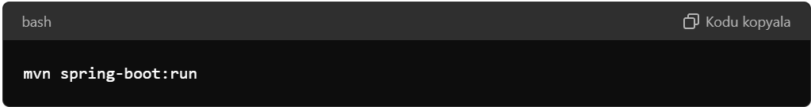

# LibraryManagmentApi - Spring Boot REST API

## Proje Açıklaması
Bu proje, kütüphane yönetimi için bir REST API'dir. Spring Boot kullanılarak geliştirilmiş olup, CRUD operasyonları ve iş mantığı içerir. Proje, kitaplar, yazarlar, kategoriler, yayınevleri ve kitap ödünç alma işlemlerini yönetir.

## Teknolojiler
* **Spring Boot:** Uygulama geliştirme çerçevesi
* **Maven:** Proje yönetim ve yapı aracı
* **PostgreSQL:** Veritabanı
* **Lombok:** Java sınıflarında boilerplate kodu azaltmak için
* **Validation:** Girdi doğrulama
* **ModelMapper:** DTO ve Entity nesneleri arasında dönüştürme
* **JPA/Hibernate:** ORM (Object-Relational Mapping)

## Proje Yapısı

### Katmanlar
* **Entity:** Veritabanı tablolarını temsil eder.
* **Repository:** Veritabanı işlemleri için CRUD metotlarını sağlar.
* **Service:** İş mantığını içerir.
* **Controller:** HTTP isteklerini işleyip yanıtları yönetir

### Entity Sınıfları
1. **Book:** Kitap bilgilerini içerir.
2. **Author:** Yazar bilgilerini içerir.
3. **Category:** Kitap kategorilerini içerir.
4. **Publisher:** Yayın evi bilgilerini içerir.
5. **BookBorrowing:** Kitap ödünç alma işlemlerini takip eder.

## Kullanım
* Projeyi yerel olarak çalıştırmak için:
    
* API uç noktalarını test etmek için Postman veya benzeri bir araç kullanabilirsiniz.

